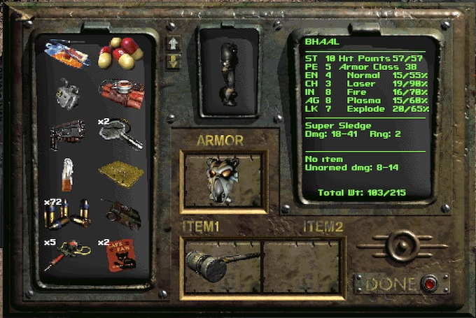
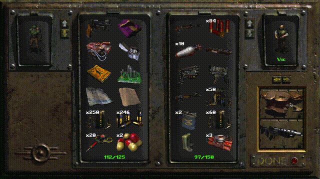
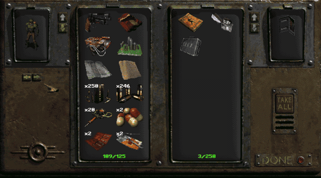
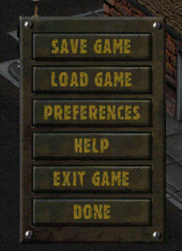

# Fallout 2 Community Engine

Fallout 2 Community Engine is a fully working re-implementation of the Fallout 2 engine, optimized for a hassle-free experience on multiple platforms, including Windows, Mac, iOS, Android, and Linux.  It provides high resolution support, quality-of-life improvements, and dozens upon dozens of bug fixes.

This is a fork of the original Fallout2: CE project, which is no longer getting regular updates.

Popular Fallout 2 total conversion mods are partially supported. Nevada and Sonora work. [Fallout 2 Restoration Project](https://github.com/BGforgeNet/Fallout2_Restoration_Project) is supported (in Beta). [Fallout Et Tu](https://github.com/rotators/Fo1in2) and [Olympus 2207](https://olympus2207.com) are not yet supported. Other mods (particularly Resurrection and Yesterday) are not tested.

Fallout2: CE has broad (though not total) compatibility with [Sfall](https://github.com/sfall-team/sfall) scripting extensions.  Many traditional Fallout mods work out of the box, including NPC Armor, Party Orders, FO2Tweaks (we recommend v14.5+), Talking Heads, and many others.

## Installation — [Download Latest CE Release](https://github.com/fallout2-ce/fallout2-ce/releases)

You *must* own the game to play. Purchase your copy on [GOG](https://www.gog.com/game/fallout_2), [Epic Games](https://store.epicgames.com/p/fallout-2) or [Steam](https://store.steampowered.com/app/38410).

Download CE from the link above, then extract the archive into your game folder. Launch `fallout2-ce.exe` on Windows (or the platform-specific executable) to play. CE has a lot of enhancements that require configuration. See [Configuration](#configuration) for examples.

For detailed instructions on how to play on Mac, Linux, iOS, or Android, see the [Platform-specific instructions](#platform-specific-installation).

## Quality of life benefits over vanilla Fallout

* High resolution support
* Party members can loot and barter in place of PC
* Directly equip party members instead of convincing them to use the right equipment.
* Expanded 2-column inventory, loot screens
* Expanded 4-row barter screen
* Expanded AP bar
* Ctrl-click to quickly move items when bartering, looting, or stealing, and auto-balance caps
* Music continues playing between maps
* Auto open doors
* Integrated "HELP" menu
* 44.1 kHz stereo sound/music supported, in .ogg and .wav format as well as legacy .acm
* Last used save slot is remembered
* Item/Corpse/Container/Critter highlighting (configure using [mods/sfall-mods.ini](https://github.com/sfall-team/sfall/blob/master/artifacts/config_files/sfall-mods.ini))

<table>
  <tr>
    <td align="center">
    <br>
    <sub>Expanded 2-column inventory</sub>
    </td>
    <td align="center">
      <br>
      <sub>Companion equip screen</sub>
    </td>

  </tr>
  <tr>
    <td align="center">
      <br>
      <sub>Party member loot</sub>
    </td>
    <td align="center">
      <br>
      <sub>Integrated HELP menu</sub>
    </td>
  </tr>
</table>

There are also dozens of small things that just work a little better than they did in the original.  Better pathfinding, fewer graphics glitches, less finicky weapon stacking, and much more.

## Configuration

The main configuration file is `fallout2.cfg`. This contains original game config as well as new CE settings.

Additional settings for screen resolution, UI customization, and map options are now integrated into the main `fallout2.cfg` file (previously part of `f2_res.ini` from Mash's HRP).

Here are some important settings in `fallout2.cfg` under the `[screen]` and `[ui]` sections.  See [the example config](https://github.com/fallout2-ce/fallout2-ce/tree/refs/heads/main/files/fallout2.cfg) for a full list of settings.

```ini
[screen]
resolution_x=1600 ; actual game window size (screen resolution), in pixels
resolution_y=1080
windowed=1 ; 0 = fullscreen
scale=2 ; 1 = original scale, 2 = 2x scale, etc. (e.g. at scale 2 and screen resolution 1920x1080, in-game resolution will be 960x540, thus every pixel is twice as wide and tall)

[ui]
; Maximum number of columns shown in the main inventory and loot/steal windows (valid range: 1..2)
inventory_columns=2

; Set to 1 to expand the barter/trade window vertically, adding a 4th item slot per side (requires ce.dat)
expand_barter_window=1

[qol]
; Allow opening party member inventory from the long-press context menu.
party_trade_from_menu=1

; Allow switching to companions' inventories in loot screens (and barter, in the future)
party_loot_and_barter=1
```

**Recommendations:**
- **Desktops**: Use any size you see fit.
- **Tablets**: Set these values to logical resolution of your device, for example iPad Pro 11 is 1668x2388 (pixels), but its logical resolution is 834x1194 (points).
- **Mobile phones**: Set height to 480, calculate width according to your device screen (aspect) ratio, for example Samsung S21 is 20:9 device, so the width should be 480 * 20 / 9 = 1067.

In time this stuff will receive an in-game interface, right now you have to do it manually. To see all currently working fallout2.cfg settings, just run the game once and quit. It will be automatically updated with defaults for every supported setting.
*Note*: Use of the IFACE_BAR settings requires the `f2_res.dat` file, which contains graphical assets. Various versions are available, but one compatible with the above settings can be found here: [f2_res.dat](https://github.com/fallout2-ce/fallout2-ce/raw/refs/heads/main/files/f2_res.dat)

## Platform-specific installation

### Windows

[Download](https://github.com/fallout2-ce/fallout2-ce/releases) and unzip into your `Fallout2` folder. Launch the game using `fallout2-ce.exe`.

### Linux

- Use Windows installation as a base - it contains data assets needed to play. Copy `Fallout2` folder somewhere, for example `/home/john/Desktop/Fallout2`.

- Alternatively you can extract the needed files from the GoG installer:

```console
$ sudo apt install innoextract
$ innoextract ~/Downloads/setup_fallout_2_1.02_gog_v1_\(77792\).exe -d Fallout2
```

- Download the Linux release archive, extract `fallout2-ce` and `ce.dat`, and copy them into this folder.

- Run `./fallout2-ce`.

### macOS

> **NOTE**: macOS 10.11 (El Capitan) or higher is required. Runs natively on Intel-based Macs and Apple Silicon.

- Use Windows installation as a base - it contains data assets needed to play. Copy `Fallout2` folder somewhere, for example `/Applications/Fallout2`.

- Alternatively you can use Fallout 2 from Macplay/The Omni Group as a base - you need to extract game assets from the original bundle. Mount CD/DMG, right click `Fallout 2` -> `Show Package Contents`, navigate to `Contents/Resources`. Copy `GameData` folder somewhere, for example `/Applications/Fallout2`.

- Or if you're a Terminal user and have Homebrew installed you can extract the needed files from the GoG installer.  **Note**: You must use "Offline backup game installer", not the main game installer.

```console
$ brew install innoextract
$ innoextract ~/Downloads/setup_fallout_2_1.02_gog_v1_\(77792\).exe -d fallout2
$ mv fallout2 /Applications/Fallout2
```

- [Download](https://github.com/fallout2-ce/fallout2-ce/releases) and copy `Fallout II Community Edition.app` to this folder.

- Run `Fallout II Community Edition.app`.

### Android

> **NOTE**: Fallout 2 was designed with mouse in mind. There are many controls that require precise cursor positioning, which is not possible with fingers. Current control scheme resembles trackpad usage:
- One finger moves mouse cursor around.
- Tap one finger for left mouse click.
- Tap two fingers for right mouse click (switches mouse cursor mode).
- Move two fingers to scroll current view (map view, worldmap view, inventory scrollers).

> **NOTE**: From Android standpoint release and debug builds are different apps. Both apps require their own copy of game assets and have their own savegames. This is intentional. As a gamer just stick with release version and check for updates.

- Download the Android [release](https://github.com/fallout2-ce/fallout2-ce/releases), which contains an .apk file and `ce.dat`.

- Use Windows installation as a base - it contains data assets needed to play. Copy `Fallout2` folder to your device, for example to `Downloads`. You need `master.dat`, `critter.dat`, `patch000.dat`, and `data` folder. Watch for file names - keep (or make) them lowercased (see [Configuration](#configuration)).  Copy `ce.dat` into this folder.

- Copy `fallout2-ce.apk` from the release to your device. Open it with file explorer, follow instructions (install from unknown source).

- When you run the game for the first time it will immediately present file picker. Select the folder from the first step. Wait until this data is copied. A loading dialog will appear, just wait for about 30 seconds. If you're installing total conversion mod or localized version with a large number of unpacked resources in `data` folder it can take up to 20 minutes. Once copied, the game will start automatically.

### iOS

> **NOTE**: See Android note on controls.

- Download `fallout2-ce.ipa`. Use sideloading applications ([AltStore](https://altstore.io/) or [Sideloadly](https://sideloadly.io/)) to install it to your device. Alternatively you can always build from source with your own signing certificate.

- Run the game once. You'll see error message saying "Couldn't find/load text fonts". This step is needed for iOS to expose the game via File Sharing feature.

- Use Finder (macOS Catalina and later) or iTunes (Windows and macOS Mojave or earlier) to copy `master.dat`, `critter.dat`, `patch000.dat`, `ce.dat`, and `data` folder to "Fallout 2" app ([how-to](https://support.apple.com/HT210598)). Watch for file names - keep (or make) them lowercased (see [Configuration](#configuration)).

-

**Controls on iPad:**

- One-finger tap → left click; hold → left button held.
- Two-finger tap → right click (cycles cursor mode between walk and attack).
- One-finger drag → scroll map / windows.
- Two-finger drag → mouse wheel.
- **Three-finger swipe down → ESC** (opens options / main menu).
- **Four-finger long press → F6** (quicksave). Hold four fingers on the screen for about half a second.
- **Three-finger long press → hold Shift** (highlights interactable objects — containers, doors, items — while held).
- Taps on the HUD (interface bar / end-turn / end-combat buttons) act as direct touches so small buttons are easy to hit without aiming.
- A Bluetooth keyboard works for everything else (numbered dialog choices, load game, etc.).

### Browser

> **NOTE**: WebAssembly build with emscripten
```
docker run --rm -v $(pwd):/src emscripten/emsdk:3.1.74 sh -c 'git config --global --add safe.directory "*" && mkdir -p build && cd build && emcmake cmake ../ -DCMAKE_TOOLCHAIN_FILE=../cmake/toolchain/Emscripten.cmake && emmake make'
```
- Demo available at https://github.com/ololoken/fallout2-ce-ems.git


## Contributing

For build instructions and contributor notes, see [CONTRIBUTING.md](CONTRIBUTING.md).

Integrating Sfall goodies is the top priority. Quality of life updates are OK too.  In any case open up an issue with your suggestion or to notify other people that something is being worked on.

For current sfall compatibility status and the remaining work needed to close gaps, see [SFALL_COMPATIBILITY.md](SFALL_COMPATIBILITY.md).

## For modders

* Robust (though not 100%) Sfall opcode and hook support
* .ogg/.wav support for map music
* .png support for static assets (must be 8bit indexed)
* .zip support for .dat archives
* Working BIS mapper

## License

The source code is this repository is available under the [Sustainable Use License](LICENSE.md).
